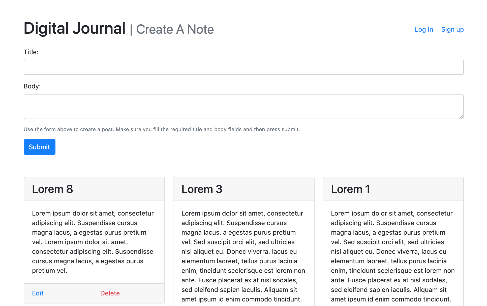

# Chingu Voyage Pre-work Project (Tier 3): Journal App



## Overview

The goal of this project is to complete the Tier 3 Solo Project for [Chingu][1]
Voyage 11.

## Run Locally

You will need to setup some mongodb database somewhere such as
[MongoDB Atlas][2], or locally running a Mongo Docker image.

### Clone Repo

```bash
git clone https://github.com/jnmorse/voyage-prework-tier3-journal-app.git
cd voyage-prework-tier3-journal-app
npm install
```

### Setup

Create an .env file in the base directory with the MongoDB URI.

```env
MONGODB_URI="mongodb://localhost/journal-app"
```

### Run The App For Development

```bash
npm run dev
```

### Run for Production

```bash
npm start
```

[1]: https://chingu.io/ 'Chingu'
[2]: https://www.mongodb.com/cloud/atlas/ 'MongoDB Atlas'
